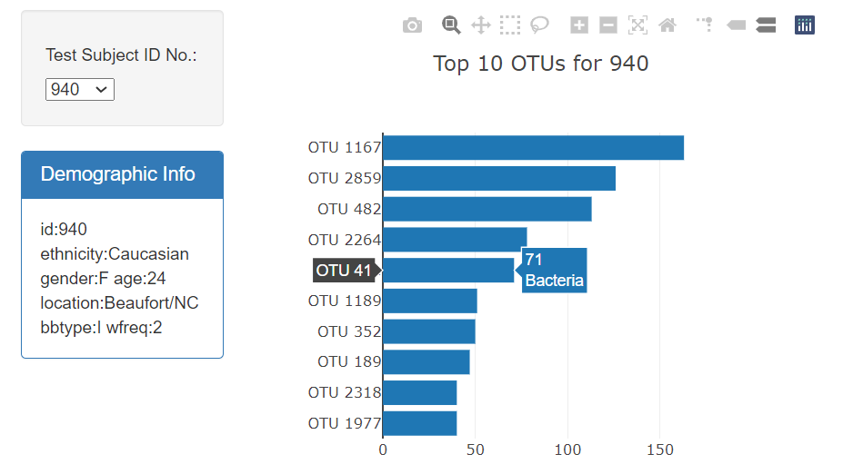
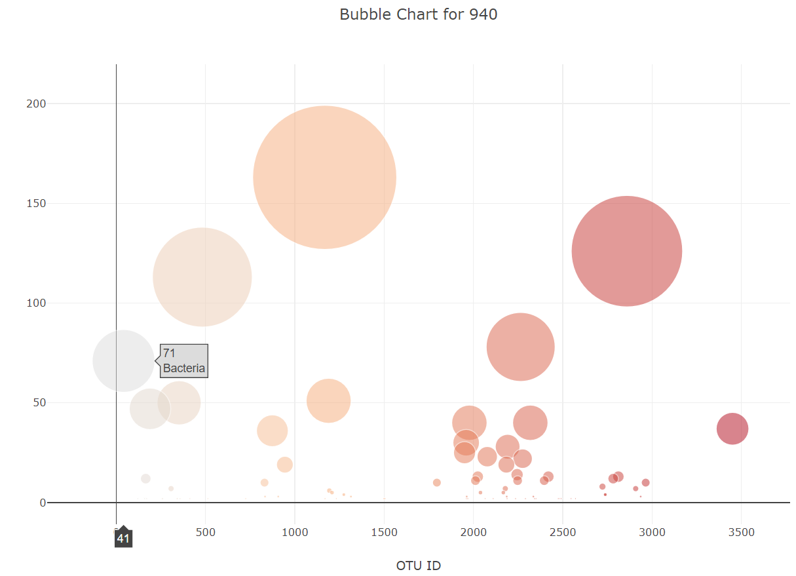

# javascript-challenge

Build an interactive dashboard to explore the Belly Button Biodiversity dataset, which catalogs the microbes that colonize human navels. The dataset reveals that a small handful of microbial species (also called operational taxonomic units, or OTUs, in the study) were present in more than 70% of people, while the rest were relatively rare.

Dataset from : https://2u-data-curriculum-team.s3.amazonaws.com/dataviz-classroom/v1.1/14-Interactive-Web-Visualizations/02-Homework/samples.json

Deployed link - https://devibalao.github.io/javascript-challenge/

#### Details:
Test Subject ID has the list of Ids from the dataset. When a particular Id is selected, 

* The Demographic Info section shows the details of the selected Id (person).

* The horizontal bar chart loads the OTU Id and sample value of top 10 OTUs for that selected Id. On hovering, the OTU label (microbial names) will be displayed.

* The Bubble chart shows the OTU Id and the sample value for all the OTUs for the selected Id. On hovering, the OTU label (microbial names) will be displayed.

